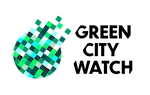

=======================================
Welcome to GCW_toolkit's documentation!
=======================================

.. contents:: Content of this page

What is GCW Toolkit?
^^^^^^^^^^^^^^^^^^^^

GCW Toolkit was made to analyse surface water in urban areas in Indonesia. There are now 4 steps to this process.

1. Delineate the water areas

Whitin the water areas 3 variables are measured:

1. Determine the changes in green space in a 50m buffer zone surrounding the water.
2. Sedimentation load in the water relative to other water areas in the city.
3. Overlap between the water area with the local cadastral maps (if available).

Water delineation
^^^^^^^^^^^^^^^^^

Water delineation is done as a start. The govt. of Indonesia has specified that water delineation needs to be accurate with 90% of the lines within a 4.5 meter radius of the actual location. This means that precision and recall both need to be >90%. We have developed a workflow that is capable of delivering this accuracy. ::

    print('hello')
    >> hello

That was some code that was there

Contents of the documentation
^^^^^^^^^^^^^^^^^^^^^^^^^^^^^

.. toctree::
   :maxdepth: 3

   Water Delineation
   Changes in Greenspace
   Sedimentation load
   Cadastral overlap
   license
   help

